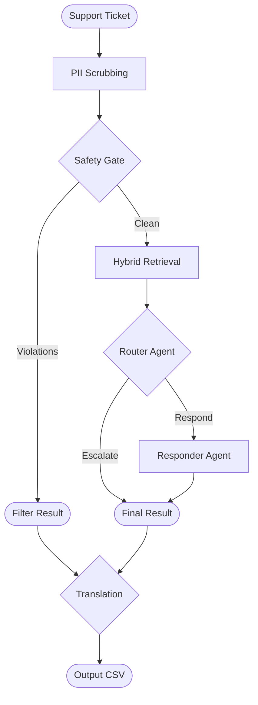

# Support Triage Pipeline

An automated triage system designed to classify, ground, and respond to support tickets across the HackerRank, Claude, and Visa ecosystems using a local-only knowledge base.

Read [`problem_statement.md`](./problem_statement.md) for the full task spec, input/output schema, and allowed values.

## The Problem

The primary challenge is building a high-fidelity support agent that:
1. **Prevents Hallucination**: Responses must be grounded *exclusively* in the provided 1,000+ document corpus.
2. **Maintains Privacy**: PII must be redacted before hitting any LLM endpoint.
3. **Ensures Safety**: Malicious prompts, off-topic requests, and toxic inputs must be caught by deterministic filters before incurring LLM costs.
4. **Handles Multi-Domain**: Needs to accurately route between three distinct product domains with overlapping terminology.

## Architecture



## Specification

The pipeline processes support tickets from a CSV and generates structured triage results.

- **Input**: `support_tickets/support_tickets.csv` (contains ticket text and metadata).
- **Output**: `support_tickets/output.csv` (populated with the following schema).

### Output Schema

| Field | Description | Allowed Values |
| :--- | :--- | :--- |
| `status` | Action taken by the agent | `replied`, `escalated` |
| `product_area` | Specific domain area | e.g., `account-management`, `api-faq` |
| `request_type` | Nature of the ticket | `product_issue`, `feature_request`, `bug`, `invalid` |
| `response` | User-facing answer | Grounded in `data/` corpus |
| `justification` | Internal rationale | Concise logic for the decision |

## Implementation Details

- **Retrieval**: Triple-pass system using [BM25](https://pypi.org/project/rank-bm25/) (lexical), [`all-MiniLM-L6-v2`](https://huggingface.co/sentence-transformers/all-MiniLM-L6-v2) (dense), and [`ms-marco-MiniLM-L-6-v2`](https://huggingface.co/cross-encoder/ms-marco-MiniLM-L-6-v2) (reranker).
- **Safety**: Regex injection filters + zero-shot classification ([`bart-large-mnli`](https://huggingface.co/facebook/bart-large-mnli)) + toxicity detection ([Detoxify](https://github.com/unitaryai/detoxify)).
- **Privacy**: Dual-layer PII masking via [Microsoft Presidio](https://microsoft.github.io/presidio/) and regex fallbacks.
- **Agents**: Separated Router (intent) and Responder (generation) architecture.
## Development

- Setup
Requires Python 3.11+ and `uv`.
```bash
uv sync
cp .env.example .env # Set LLM_MODEL and API keys
```

- Execution of the Pipeline (Process tickets)
```bash
uv run python -m code.main
```

## Project Structure

- **`code`**: Contains the core agent, pipeline logic, and configuration. See [`code/README.md`](./code/README.md) for a detailed module breakdown.
- **`data`**: The local-only knowledge base, segmented into product-specific corpora:
  - `hackerrank/`: Technical documentation and assessment support.
  - `claude/`: Anthropic's help center covering API and account management.
  - `visa/`: Consumer and small-business support docs.
