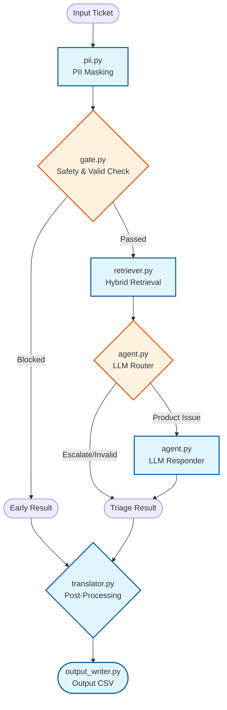

# HackerRank Orchestrate Support Agent

This directory contains the final Python submission for the HackerRank Orchestrate hackathon.

The agent triages support tickets across:

- HackerRank
- Claude
- Visa

It uses only the provided corpus in `data/` and produces the required CSV output for `support_tickets/support_tickets.csv`.

## Architecture



The pipeline is organized into six stages:

1. `gate.py`
   Pre-LLM safety and invalid-request filtering:
   - regex checks
   - RapidFuzz fuzzy invalid/off-topic matching
   - Detoxify toxicity signal
   - zero-shot invalid/off-topic classification with `facebook/bart-large-mnli`
   - optional Llama-Guard safety check

2. `retriever.py`
   Hybrid retrieval over the local support corpus:
   - BM25
   - sentence-transformer dense retrieval
   - cross-encoder reranking
   - per-company namespaces

3. `agent.py`
   Two-stage LLM triage:
   - router
   - responder

4. `pii.py`
   PII masking for ticket text before external LLM/safety-model calls:
   - Presidio-first
   - regex fallback and structured-secret masking

5. `translator.py`
   Optional post-processing for non-English tickets:
   - detects ticket language with `langdetect`
   - translates only the final `response`
   - keeps `justification` in English
   - uses cached translation calls

6. `output_writer.py`
   Writes the final CSV in the required format.

## LLM Layer

This project uses **LiteLLM** as the single LLM gateway.

That means the pipeline can run against different providers without changing application logic. The active model is selected through environment variables or `--model`.

Examples:

- `anthropic/claude-haiku-3-5`
- `openai/gpt-4o`
- `openrouter/...`

The wrapper lives in [llm.py](/home/adi/hackathons/hackerrank-orchestrate/code/llm.py).

## Setup

From the repository root:

```bash
uv sync
cp .env.example .env
```

Set the model and matching provider key in `.env`.

Typical variables:

```bash
LLM_MODEL=anthropic/claude-haiku-3-5
ANTHROPIC_API_KEY=...
```

If you use another provider, set the corresponding API key expected by LiteLLM.

## Run The Pipeline

Default full run:

```bash
uv run python -m code.main
```

Custom input/output:

```bash
uv run python -m code.main \
  --input support_tickets/support_tickets.csv \
  --output support_tickets/output.csv
```

Run a smaller smoke test:

```bash
uv run python -m code.main --tickets 5
```

Override the model:

```bash
uv run python -m code.main --model openai/gpt-4o
```

Add cooldowns to reduce rate-limit bursts:

```bash
uv run python -m code.main \
  --cooldown-every 4 \
  --cooldown-seconds 20
```

See all CLI options:

```bash
uv run python -m code.main --help
```

## Output

The main output file is:

```bash
support_tickets/output.csv
```

It contains:

- `status`
- `product_area`
- `response`
- `justification`
- `request_type`

## Evaluate On The Sample Set

To compare a generated sample output against the expected sample labels:

```bash
uv run python -m code.eval_sample \
  --expected support_tickets/sample_support_tickets.csv \
  --actual support_tickets/sample_output.csv \
  -v
```

### How to read the score

If you see something like:

- `Status accuracy: 90%`
- `Request type accuracy: 90%`
- `Product area accuracy: 0%`
- `Weighted score: 73.5%`

that means:

- routing is mostly right
- request classification is mostly right
- `product_area` is currently the weakest field

In other words, a score like `73.5%` does **not** mean the whole system is broken. It usually means the pipeline is functioning, but the taxonomy / product-area mapping still needs work.

## Debug Retrieval

Interactive retrieval debugger:

```bash
uv run python -m code.retriever_debug
```

Example:

```bash
uv run python -m code.retriever_debug \
  --company HACKERRANK \
  --top-k 5 \
  --threshold 0.45
```

It prints:

- whether the threshold passed
- top retrieved documents
- scores
- product areas
- short previews

It also writes a local debug log under `logs/`.

## Logging

Application logs are written to:

```bash
logs/orchestrate.log
```

The logger configuration is centralized in:

- [config.py](/home/adi/hackathons/hackerrank-orchestrate/code/config.py)
- [logger.py](/home/adi/hackathons/hackerrank-orchestrate/code/logger.py)

## Main Libraries Used

Core pipeline:

- `litellm`
- `sentence-transformers`
- `transformers`
- `rank-bm25`
- `numpy`
- `scikit-learn`

Safety / validation:

- `detoxify`
- `RapidFuzz`
- `presidio-analyzer`
- `presidio-anonymizer`

Utilities:

- `langdetect`
- `python-dotenv`
- `PyYAML`
- `markdownify`
- `lxml`
- `colorama`