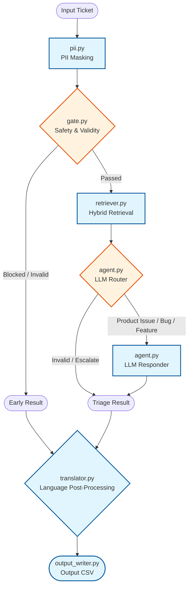

# HackerRank Orchestrate — Support Triage Agent

**Author:** Aditya Bavadekar

A production-grade, fully-local AI pipeline that classifies and responds to support tickets across three products: **HackerRank**, **Claude (Anthropic)**, and **Visa**. Built for the HackerRank Orchestrate hackathon (May 2026).

---

## Architecture



---

## Pipeline Stages

### Stage 0 — PII Masking (`pii.py`)

Before any text leaves the system (to LLMs, safety models, or external services), all sensitive data is redacted:

- **Presidio-first**: Uses Microsoft Presidio for entity detection (emails, phone numbers, credit card numbers, SSNs, names) when enabled via `PRESIDIO_ENABLED=true`.
- **Regex fallback**: Falls back to hand-crafted regex patterns for emails, phone numbers, IP addresses, card numbers, bearer tokens, and structured secrets (e.g. `api_key=...`) when Presidio is unavailable.
- **Fail-open design**: If Presidio fails at runtime (missing model files, import error), the pipeline continues using the regex layer rather than crashing.
- **Startup audit**: `log_pii_mode()` is called at boot to explicitly log whether Presidio or regex-only mode is active.

---

### Stage 1 — Safety Gate (`gate.py`)

A multi-layer, pre-LLM filter that short-circuits bad requests before incurring any LLM cost:

| Layer | Technique | What it catches |
|---|---|---|
| Regex | `_CONVERSATIONAL_RE` | Pure greetings (hi, hey, howdy) |
| Regex | `_GRATITUDE_RE` | "Thank you", "thanks for helping me" → replies "Happy to help" |
| Regex | `_OFF_TOPIC_RE` | Requests for code generation, weather, recipes |
| Regex | `_NOISE_RE` / `_LOW_SIGNAL_RE` | Symbol-only strings, long gibberish runs |
| Regex | Prompt injection patterns | Jailbreak phrases ("ignore previous instructions") |
| Fuzzy | RapidFuzz vs. `_INVALID_ANCHORS` | Near-matches to known invalid anchors |
| Fuzzy | RapidFuzz vs. `_VALID_ANCHORS` | Near-matches to known legitimate support phrases |
| Semantic | `facebook/bart-large-mnli` (zero-shot) | Off-topic / unsupported classification |
| ML | `Detoxify` (unbiased model) | Toxic, threatening, or insulting content |
| Keyword | `_HARD_ESCALATION_PATTERNS` | Identity theft, fraud, data breach, legal threats → immediately escalate |
| Keyword | `_SOFT_ESCALATION_PATTERNS` | Lost/stolen card → allow retrieval first, escalate only if corpus can't help |

**Design decisions:**
- **Gratitude is separated from conversational filler** — "thank you" gets a warm `"Happy to help"` instead of the generic `"I am a support assistant"` response.
- **Soft escalation for card-related queries** — "lost card" / "card stolen" are NOT immediately escalated; the retriever is given a chance to find useful Visa corpus docs first.
- **Multi-intent splitting** — tickets containing "also", "additionally", or "another question" are split and processed as independent sub-issues that are merged at the end.

---

### Stage 2 — Hybrid Retrieval (`retriever.py`)

The retriever uses a **three-pass hybrid approach**:

#### Pass 1 — Query Pre-processing
1. **Normalization**: Lowercases, applies informal-to-formal rewrites (`dont → do not`, `cant → cannot`, `plz → please`, `u → you`).
2. **Query expansion**: Appends domain-specific synonyms for known keywords. Fires on **all** queries (no word-count cap) — e.g.:
   - `cash` → `cash advance ATM withdraw emergency funds card`
   - `urgent` → `urgent emergency assistance immediate help`
   - `login` → `login sign in authentication account access password`
   - `assessment` → `assessment test coding challenge interview evaluation`
   - `stolen` / `lost` / `card` → Visa emergency terms

#### Pass 2 — Hybrid BM25 + Dense Retrieval
- **BM25** (lexical): `rank-bm25` with stopword filtering. Weight: `35%`.
- **Dense** (semantic): `all-MiniLM-L6-v2` via `sentence-transformers`. Weight: `65%`.
- **Per-company namespaces**: Each of the three companies (HackerRank, Claude, Visa) has a separate index. When the company is known, only that namespace is searched. When `Company.NONE`, all three are searched and the best-scoring namespace wins (which also infers the company).

#### Pass 3 — Cross-encoder Reranking
- `cross-encoder/ms-marco-MiniLM-L-6-v2` reranks the top candidates.
- A separate `_RERANK_THRESHOLD` (0.45) gates the final result.
- **Product-area boosting** (`_PRODUCT_AREA_BOOST = 0.10`): After the router classifies the product area, docs matching that area get a score boost to surface more targeted context.

#### Threshold Fallback
When the reranker score is below threshold, the ticket enters `process_low_retrieval()` instead of proceeding to the normal responder. This avoids hallucination by letting the router decide whether to escalate or attempt an answer with limited evidence.

**Embedding cache**: Dense embeddings are cached in-process with `lru_cache` keyed by (text hash, model name) so repeated or similar queries never re-embed.

---

### Stage 3 — LLM Triage (`agent.py`)

A **two-agent** pipeline runs sequentially, each calling the LLM once:

#### Router Agent
Classifies the ticket into structured fields:
```json
{
  "product_area": "<from candidates>",
  "request_type": "product_issue | feature_request | bug | invalid",
  "status": "replied | escalated",
  "inferred_company": "hackerrank | claude | visa | none",
  "confidence": 1-5,
  "invalid_reason": "greeting | off_topic | conversational | gibberish | insult | out_of_scope_service | null"
}
```

**Routing rules enforced in the system prompt:**
- A ticket with a real complaint should never be classified `invalid` just because context is missing — use `product_issue + escalated` instead.
- `inferred_company` is used to re-filter already-retrieved docs without a second retrieval call, saving cost.
- `confidence < 3` → product area is overridden to `"general"` to prevent false specificity.

**Invalid reason → response mapping:**

| `invalid_reason` | Response |
|---|---|
| `greeting` | "Happy to help! If you need anything else, feel free to ask." |
| `conversational` | "Please describe the issue you're experiencing…" |
| `gibberish` | "Your message was unclear. Please describe your issue…" |
| `insult` | "I'm here to help with product support. Please describe your issue…" |
| `off_topic` | "I'm sorry, this is outside the scope of what I can help with…" |
| `out_of_scope_service` | "I can only assist with HackerRank, Claude, and Visa products…" |
| `null` | Generic fallback |

**Low-retrieval bypass** (`process_low_retrieval`):
- If retrieval score is below threshold but the router is **highly confident** (`confidence >= 4`) the ticket is a real support issue, the responder is called directly rather than escalating.
- This prevents false escalations like *"i can not able to see apply tab"* (score 0.42, confidence 5/5).

#### Responder Agent
Generates the final user-facing response:
- Grounded **strictly** in the retrieved context — the prompt explicitly forbids using outside knowledge.
- Enforces step-by-step formatting when instructions are present.
- Validates and deduplicates all `[sources: ...]` citations, replacing raw LLM source blocks with a single canonical block.
- **Source validation**: Raw source paths cited by the LLM are verified against the actual loaded document IDs. Hallucinated sources are dropped silently; if no valid sources remain, the top-scored retrieved doc IDs are used as fallback (only if their score is > 0.4).

---

### Stage 4 — PII Masking (repeat)

Ticket text is scrubbed again before the responder prompt is assembled. This covers cases where PII appears in the subject or structured metadata fields that weren't in the first pass.

---

### Stage 5 — Translation (`translator.py`)

Applied **after** the full triage result is produced:

- **Language detection**: `langdetect` with `DetectorFactory.seed = 42` for determinism. ASCII-heavy text (>95% ASCII chars) is fast-pathed as English to avoid detection cost. Results with `< 0.90` confidence probability are ignored.
- **Translation**: Only the `response` field is translated. `justification` always stays in English for internal review.
- **Prompt context**: The user's original ticket text is appended to the translation prompt so the LLM can use context to translate domain terms correctly.
- **Preservation rules**: Product names (HackerRank, Claude, Visa), URLs, file paths, source citations, and technical terms are preserved verbatim.

---

### Caching (`cache.py`)

Two-layer cache to minimize LLM and embedding costs:

| Layer | Backend | Scope | Key |
|---|---|---|---|
| In-process | `functools.lru_cache` | Current session | SHA-256 of scrubbed, normalized input |
| Persistent | `diskcache` (`.cache/`) | Across runs | Same hash |

Cache namespaces: `llm`, `embed`, `translate`, `detect`. All cache keys are derived from **scrubbed** text so PII-containing text is never persisted to disk.

---

### Edge Cases Handled

| Scenario | Handling |
|---|---|
| Non-English ticket | Detected and response translated back to the user's language |
| Mixed-language ticket | ASCII-ratio shortcut avoids mis-detecting English as another language |
| "Thank you / thanks" | `_GRATITUDE_RE` → `"Happy to help"` (not the generic invalid response) |
| Prompt injection attempts | Regex + RapidFuzz fuzzy match → blocked before LLM |
| Toxic / insulting content | Detoxify ML model → blocked, polite rejection returned |
| Multi-intent tickets | Split on conjunctions, processed independently, results merged |
| Low retrieval score + high router confidence | Bypass escalation → attempt answer with available docs |
| Genuinely vague ticket ("it's not working, help") | Low retrieval + low router confidence → escalate |
| Company unknown in ticket | Router infers company; docs filtered to inferred company without re-retrieval |
| LLM cites hallucinated sources | Source validation strips invalid citations; falls back to top retrieved doc IDs |
| Fraud / identity theft keywords | Hard escalation pattern → immediately routed to human without LLM call |
| Lost/stolen card | Soft escalation → retriever runs first; only escalates if corpus can't help |

---

## LLM Gateway

Uses **[LiteLLM](https://github.com/BerriAI/litellm)** as the single provider-agnostic gateway. Swap the model without changing any application code:

```bash
# Anthropic
LLM_MODEL=anthropic/claude-haiku-3-5
ANTHROPIC_API_KEY=sk-ant-...

# OpenAI
LLM_MODEL=openai/gpt-4o-mini
OPENAI_API_KEY=sk-...

# OpenRouter (any model)
LLM_MODEL=openrouter/anthropic/claude-3-haiku
OPENROUTER_API_KEY=...
```

---

## Setup

**Requirements:** Python >= 3.11.9, [uv](https://docs.astral.sh/uv/)

From the repository root:

```bash
uv sync
cp .env.example .env
# Edit .env with your model and API key
```

> **First run — model downloads**: The pipeline auto-downloads the following models from HuggingFace on first execution (~1–2 GB total). Subsequent runs use the local cache.
>
> | Model | Used for |
> |---|---|
> | `all-MiniLM-L6-v2` | Dense retrieval embeddings |
> | `cross-encoder/ms-marco-MiniLM-L-6-v2` | Retrieval reranking |
> | `facebook/bart-large-mnli` | Zero-shot off-topic classification (gate) |
> | `unbiased` (Detoxify) | Toxicity / insult detection (gate) |

---

## Run the Pipeline

**Full run (all tickets):**
```bash
uv run python -m code.main
```

**Custom input/output paths:**
```bash
uv run python -m code.main \
  --input support_tickets/support_tickets.csv \
  --output support_tickets/output.csv
```

**Smoke test (first N tickets):**
```bash
uv run python -m code.main --tickets 5
```

**Override model at runtime:**
```bash
uv run python -m code.main --model openai/gpt-4o
```

**Rate-limit cooldown between batches:**
```bash
uv run python -m code.main \
  --cooldown-every 4 \
  --cooldown-seconds 20
```

**All CLI options:**
```bash
uv run python -m code.main --help
```

---

## Evaluate on the Sample Set

```bash
uv run python -m code.eval_sample \
  --expected support_tickets/sample_support_tickets.csv \
  --actual   support_tickets/sample_output.csv \
  -v
```

**Weighted scoring:**

| Metric | Weight |
|---|---|
| Status accuracy | 35% |
| Request type accuracy | 30% |
| Product area accuracy | 20% |
| Response non-empty | 15% |

> **Note on product area accuracy**: There is a label-space mismatch between the internal corpus taxonomy (used by the retriever and router) and the external Zendesk labels in the evaluation CSV. A `0%` product area score does not mean responses are wrong — it means the label names differ between systems.

---

## Debug Retrieval

Interactive retrieval debugger for tuning thresholds:

```bash
uv run python -m code.retriever_debug
```

With options:
```bash
uv run python -m code.retriever_debug \
  --company HACKERRANK \
  --top-k 5 \
  --threshold 0.45
```

Prints threshold pass/fail, top docs with scores, product areas, and doc previews. Writes a debug log to `logs/`.

---

## Tests

```bash
uv run pytest code/tests -v
```

Test coverage:
- `test_gate.py` — gate layer: greetings, insults, off-topic, prompt injection, valid support queries
- `test_gate_v2.py` — edge cases: gratitude, multi-intent detection, soft vs hard escalation
- `test_pii.py` — PII scrubbing: emails, phone numbers, card numbers, bearer tokens
- `test_prompt_scrubbing.py` — verifies PII is removed before LLM prompt assembly
- `test_low_retrieval_routing.py` — confidence bypass, invalid reason mapping, escalation fallback

---

## Key Libraries

| Library | Purpose | License |
|---|---|---|
| `litellm` | LLM provider gateway (Anthropic, OpenAI, OpenRouter, …) | MIT |
| `sentence-transformers` | Dense retrieval embeddings (`all-MiniLM-L6-v2`) | Apache-2.0 |
| `rank-bm25` | BM25 lexical retrieval | Apache-2.0 |
| `transformers` | Zero-shot classification (`bart-large-mnli`), reranker | Apache-2.0 |
| `detoxify` | Toxicity / threat / insult detection | Apache-2.0 |
| `rapidfuzz` | Fuzzy string matching for invalid/off-topic anchors | MIT |
| `diskcache` | Persistent LRU cache for LLM and embedding calls | Apache-2.0 |
| `langdetect` | Language detection for non-English tickets | Apache-2.0 |
| `presidio-analyzer` | PII entity detection (optional) | MIT |
| `presidio-anonymizer` | PII redaction (optional) | MIT |
| `numpy` | Vector arithmetic for retrieval scoring | BSD |
| `scikit-learn` | Cosine similarity | BSD |
| `python-dotenv` | `.env` file loading | BSD |
| `markdownify` | Markdown conversion of corpus HTML | MIT |
| `colorama` | Coloured terminal log output | BSD |

---

## Logging

```bash
logs/orchestrate.log
```

Configured in `config.py` and `logger.py`. Structured per-module loggers with configurable levels via `LOG_LEVEL` env var.

---

## File Map

```
code/
├── main.py               CLI entry point
├── pipeline.py           Orchestrates stages 1-5 per ticket
├── gate.py               Pre-LLM safety + validity filter
├── retriever.py          Hybrid BM25 + dense retrieval + reranking
├── agent.py              Router and Responder LLM agents
├── pii.py                PII masking (Presidio + regex)
├── translator.py         Post-generation language translation
├── cache.py              Two-layer cache (lru_cache + diskcache)
├── validator.py          JSON parsing, enum correction, source validation
├── output_writer.py      CSV output writer
├── corpus_loader.py      Loads and indexes data/ corpus
├── llm.py                LiteLLM wrapper with retry and caching
├── config.py             All constants and env-var config
├── logger.py             Structured logging setup
├── models.py             Shared dataclasses (SupportTicket, TriageResult, …)
├── phrases.py            Fuzzy anchor phrase lists for the gate
├── eval_sample.py        Sample-set evaluation script
├── retriever_debug.py    Interactive retrieval debugger
└── tests/
    ├── test_gate.py
    ├── test_gate_v2.py
    ├── test_pii.py
    ├── test_prompt_scrubbing.py
    └── test_low_retrieval_routing.py
```